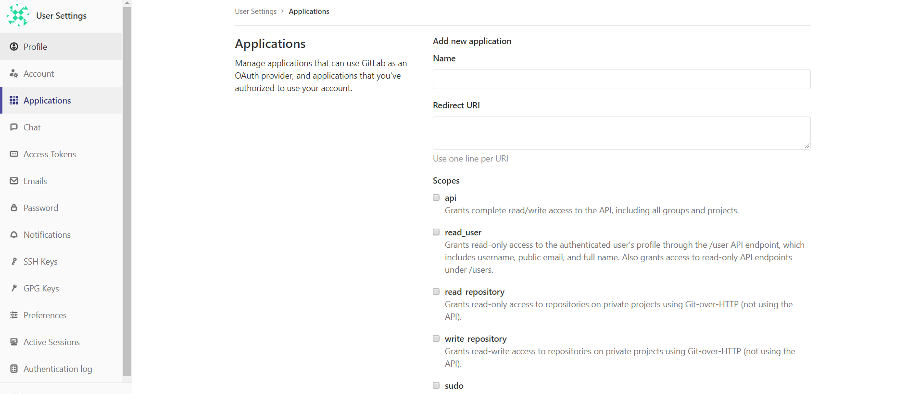
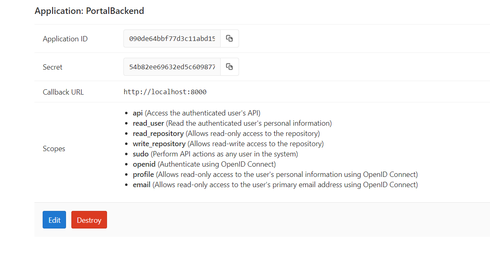

# Gitlab

Main References: https://www.jianshu.com/p/080a962c35b6

## 用docker安装Gitlab

```
$ docker run -d -p 443:443 -p 80:80 -p 22:22 --name gitlab --restart always -v /home/gitlab/config:/etc/gitlab -v /home/gitlab/logs:/var/log/gitlab -v /home/gitlab/data:/var/opt/gitlab gitlab/gitlab-ce
# -d：后台运行
# -p：将容器内部端口向外映射
# --name：命名容器名称
# -v：将容器内数据文件夹或者日志、配置等文件夹挂载到宿主机指定目录
```

如果出现端口占用，替换宿主机端口：
```
$ docker run -d -p 8443:443 -p 8080:80 -p 22:22 --name gitlab --restart always -v /home/gitlab/config:/etc/gitlab -v /home/gitlab/logs:/var/log/gitlab -v /home/gitlab/data:/var/opt/gitlab gitlab/gitlab-ce
```

## Gitlab APIs

### 授权

Reference: https://docs.gitlab.com/ee/api/oauth2.html

#### 配置第三方server信任你的应用

拿Gitlab为例：

添加你的应用，注意到Redirect URI了吗？这个后面要用到。


添加完成后你就可以拿到你的application相关的信息了：


#### 授权码模式

该模式是在用户要访问第三方资源时将用户重定向到第三方server的认证页面，完成认证后再重定向回到应用的页面，并携带授权码。

首先在用户请求资源时将用户重定向到/oauth/authorize，在用户同意后重定向回redirect_uri指定的值。
```
/oauth/authorize?client_id={APP_ID}&redirect_uri={REDIRECT_URI}&response_type=code&state={YOUR_UNIQUE_STATE_HASH}
```
理论上redirect_uri应该是你的应用提供的用来接收授权码的接口，也就是说在第三方server完成用户认证后会由第三方server通过这个接口将授权码传给你。
```
GET /oauth/redirect?code=1234567890&state={YOUR_UNIQUE_STATE_HASH}
```
接下来你就可以通过授权码去请求access token了：
```
POST /oauth/token?client_id={APP_ID}&client_secret={APP_SECRET}&code={AUTH_CODE}&grant_type=authorization_code&redirect_uri={REDIRECT_URI}
```
在此过程中你可能会遇到```The redirect url included is not valid```的问题，参考：https://blog.csdn.net/weixin_40161254/article/details/89971109